Azure Machine Learning - ハンズオン MNISTで手書き文字認識
=============

## 機械学習とは


## MNISTデータセットとは
国立標準技術研究所の混合データ セット (MNIST データ セット) は、さまざまな IR アルゴリズムを比較する際のベンチマークとして機能させるように、IR の研究者によって作成されました。基本的な考え方としては、テストする IR アルゴリズムまたはソフトウェア システムがある場合、MNIST データ セットに対してアルゴリズムまたはシステムを実行し、他のシステムについて以前発行された結果と比較します。

データ セットには計 70,000 枚の画像が含まれており、そのうち 60,000 枚は学習用画像 (IR モデルの作成に使用) で 10,000 枚は判別用画像 (モデルの精度の評価に使用) です。各 MNIST 画像は、1 つの手書き数字をデジタル化したものです。サイズはそれぞれ 28 x 28 ピクセルです。各ピクセル値は 0 (白) ～ 255 (黒) の値で、中間のピクセル値は灰色の網かけを表します。図 2 に示すのは、学習用セットの最初の画像 8 枚です。各画像に対応した実際の数値を識別するのは、人間には簡単ですが、コンピューターにとっては至難の業です。

## Azure Machine Learningとは


## 使い方
### Azure Machine Learningの使い方

#### WORKSPACEの作成

https://manage.windowsazure.com/
に接続しログイン

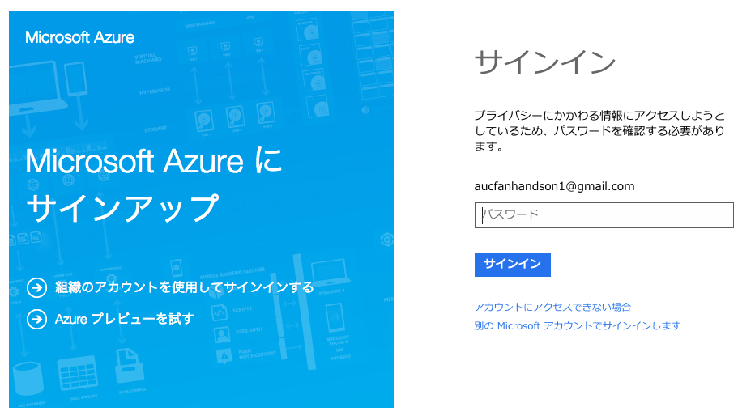

左メニューから「MACHINE LEARNING」を選択後、左下の「新規」から「簡易作成」

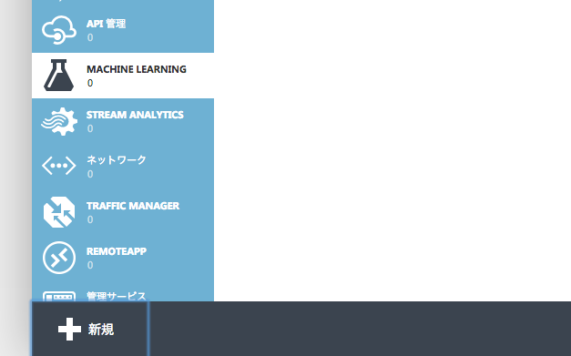

「ワークスペース名」と「ストレージアカウント名」を記入し、「MLワークスペースの作成」

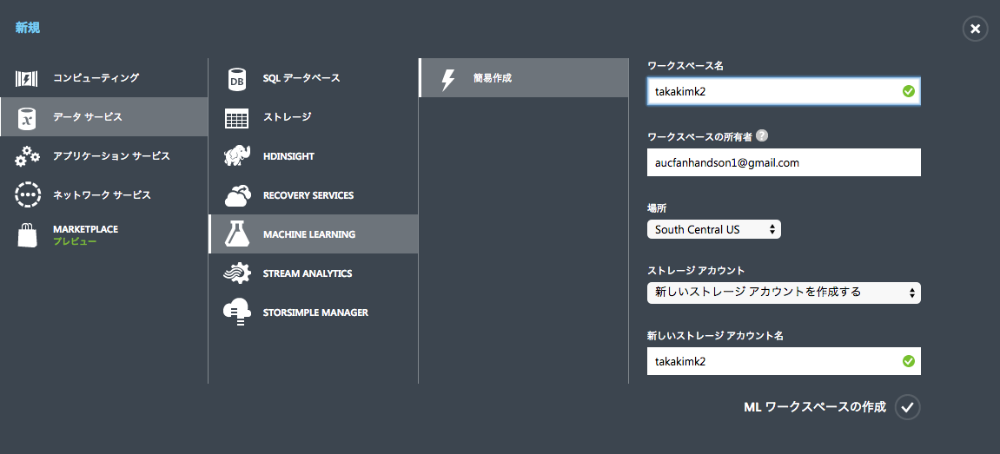

作成した「MACHINE LEARNING」を選択し、
「自分のワークスペースにアクセス」の「ML Studio にサインイン」を選択

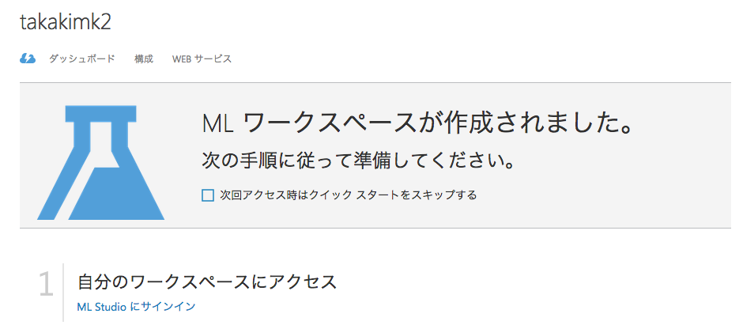

#### Experimentsの作成

左下の「NEW」から「Blank Experiment」を選択

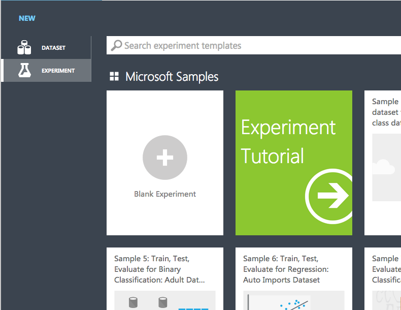
 
#### 機械学習のモデルを作成する。

Saved Datasets / MNIST Train 60k 28x28 dense をドラッグ＆ドロップ

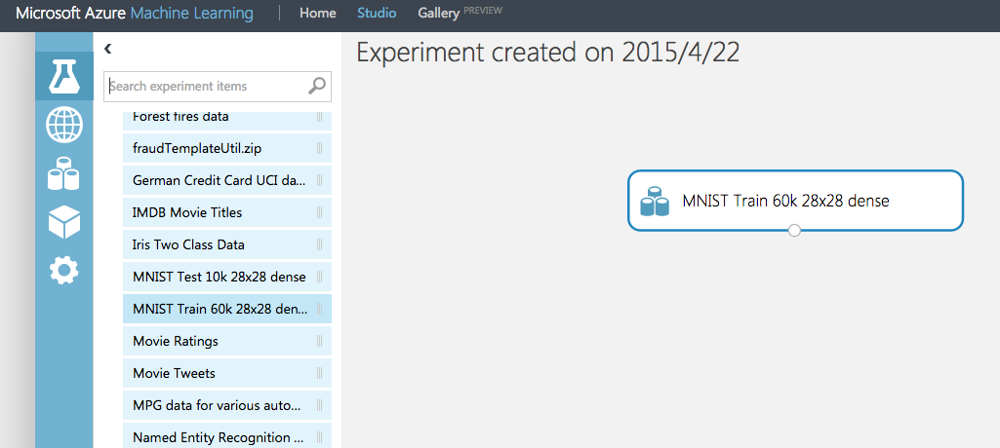

Machine Learning / Train / Train Model をドラッグ＆ドロップ

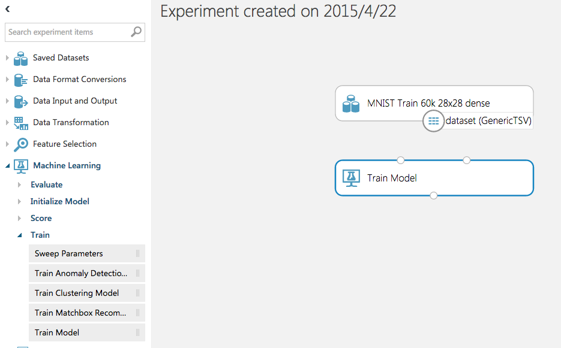

MNIST Train 60k 28x28 denseの下の点とTrain Modelの右上を線でつなげる

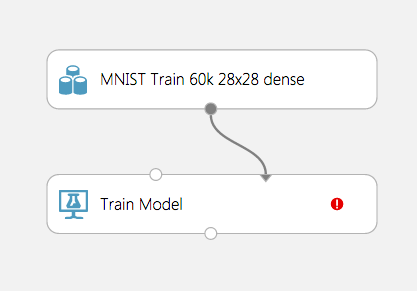

Machine Learning / Initialize Model / Classification / の

+ Multiclass Decision Forest
+ Multiclass Decision Jungle
+ Multiclass Logistic Regression
+ Multiclass Neural Network
 
上記4つの中から好きな物を選んでドラッグ＆ドロップ
Multiclass〜の下の点とTrain Modelの左上を線でつなげる

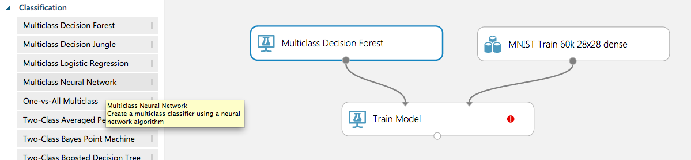

Train Modelをクリックし、右に出た「Launch column selector」を選択

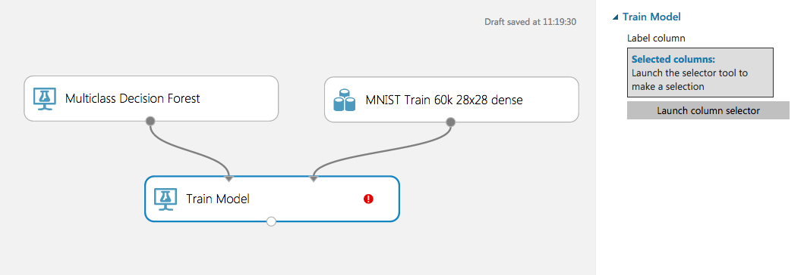

空欄のところをクリックすると一番上に「Label」があるのでこれを選択  
`>`をクリックして`SELECTED COLUMNS`に移動  
`✔`で閉じる︎

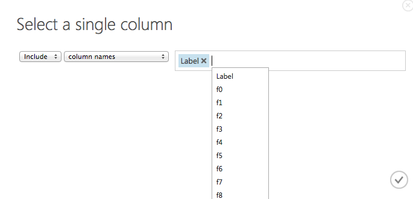

Machine Learning / Initialize Model / Score / Score Model をドラッグ＆ドロップ
Train Modelの下の点とScore Modelの左上を線でつなげる

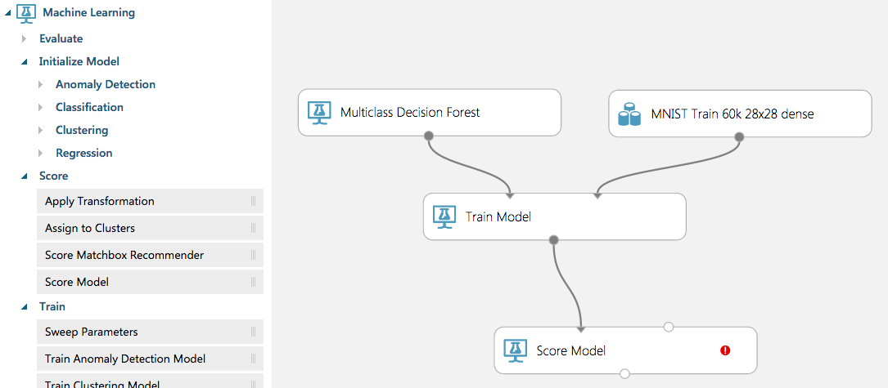

Saved Datasets / MNIST Test 10k 28x28 dense をドラッグ＆ドロップ
MNIST Test 10k 28x28 denseの下の点とScore Modelの右上を線でつなげる

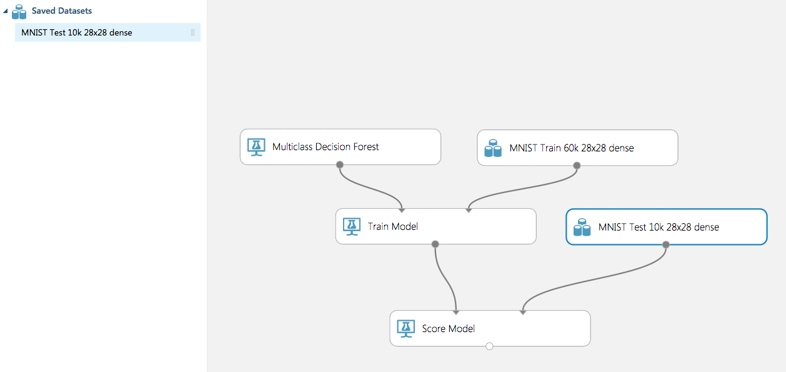

Machine Learning / Evaluate / Evaluate Model をドラッグ＆ドロップ
Score Modelの下の点とEvaluate Modelの上の点どちらかを線でつなげる

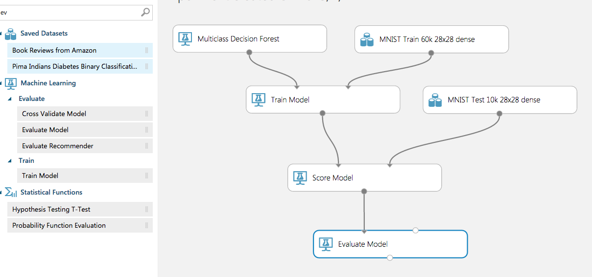

下の「RUN」ボタンをクリック
RUNが終了したら（Evaluate Modelまでチェックマークがついたら）Evaluate Modelの下の点をクリック
Visualizeを選択すると結果が表示される

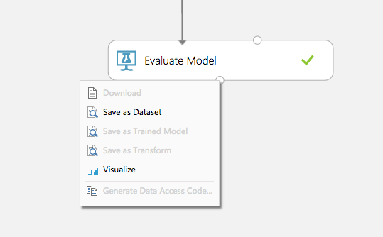

#### Web APIとして公開する準備

Web Service / Input と
Web Service / Output をドラッグ＆ドロップ

Inputの下の点とScore Modelの右上を線でつなげる  
Outputの上の点とScore Modelの下を線でつなげる  
下の方にあるフラスコマーク「Click to Swich to web service view」をクリック

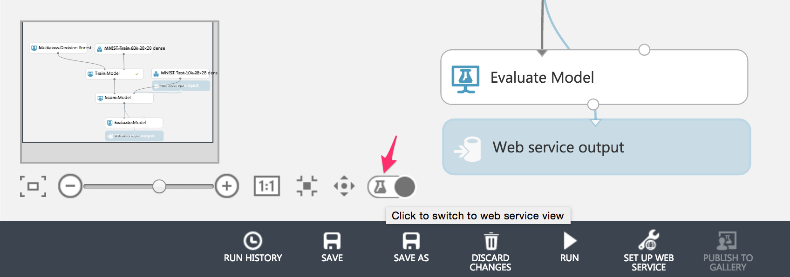

（クリックすると、画像のように地球マークになる）

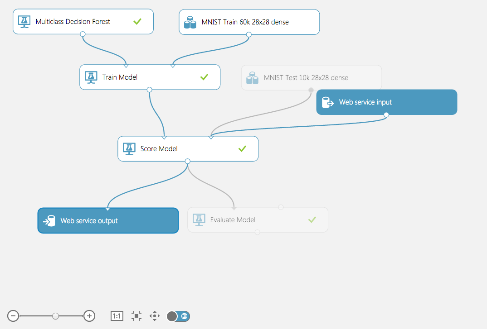

再度`RUN`をし、完了したら
下の「SET UP WEB SERVICE」の`Predictive Web Service [Recommended]`を選択

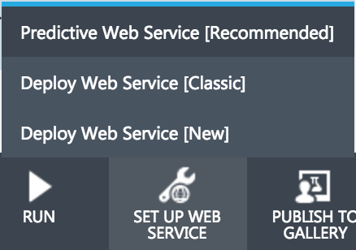

もう一度`RUN`し、完了すると表示が`Training experiment`と`Predictive experiment`タブに分かれる


`Predictive experiment`タブを選択  
下の`DEPLOY WEB SERVICE`の`Deploy Web Service [Classic]`を選択

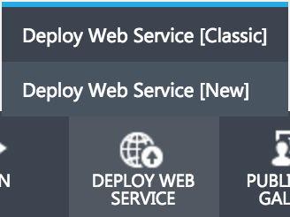
		
### Web API		
しばらくすると、下のような画面が開きます。
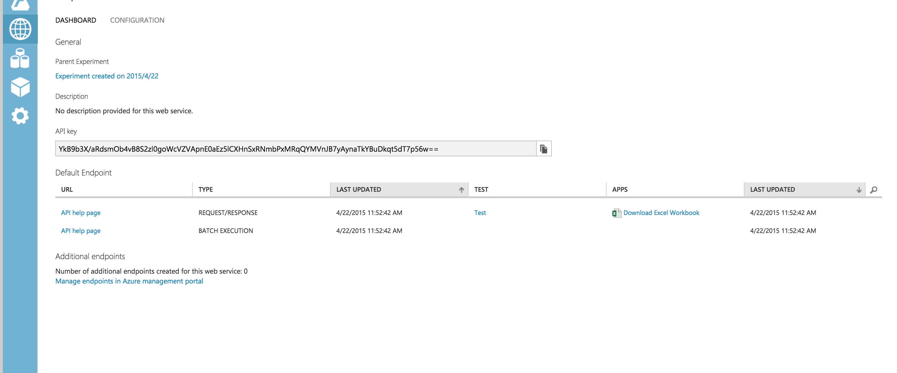


この画面では、今作成したWeb APIの仕様を確認したり、テストしたりすることができます。

APIの仕様を確認すると、どのようなエンドポイントにアクセスし、
どのようなパラメータがあり、どのようなレスポンスが帰ってくるのかを確認する事ができます。


もし自分のアプリケーションに機械学習の機能を取り込むのであれば、このドキュメントを見ることになります。

ドキュメントの最後には、R, Python, C#でのサンプルコードも載っているので、参考にすることができます。

#### Web APIのテスト
WebAPIのテストもブラウザから簡単に行う事ができます。

`Default Endpoint`の`TEST`ボタンをクリックする事で、テスト用のフォームが開きます。
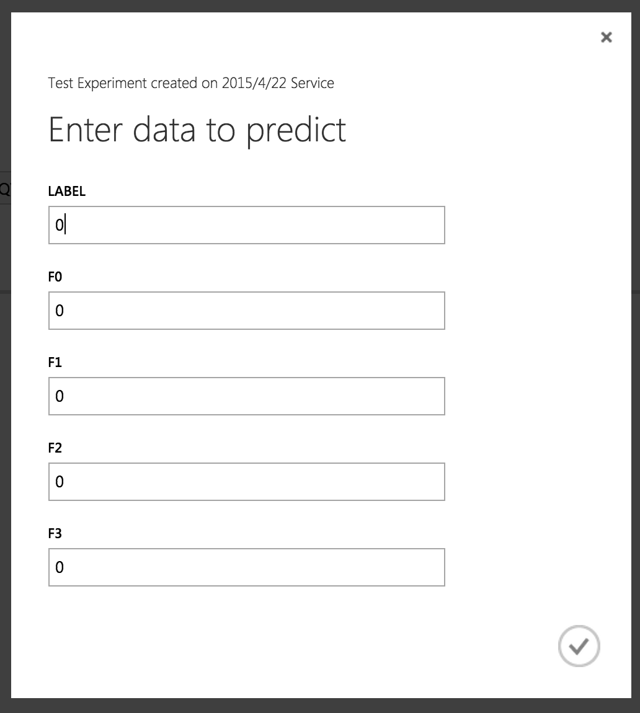

入力として必要な項目を入力し、チェックマークをクリックすると、APIに問い合わせをします。


## MNIST 確認用フォームの使い方

### AzureMLの情報を入力する

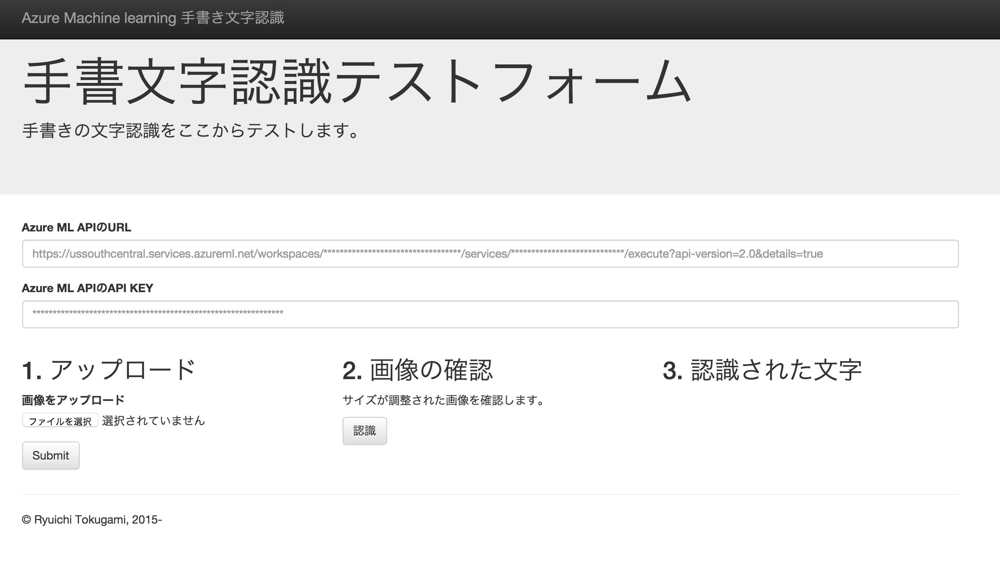
このようなページが開きます。

AzureMLのWeb Serviceから、POST先のURLととAPI KEYを入手します。

- API Key
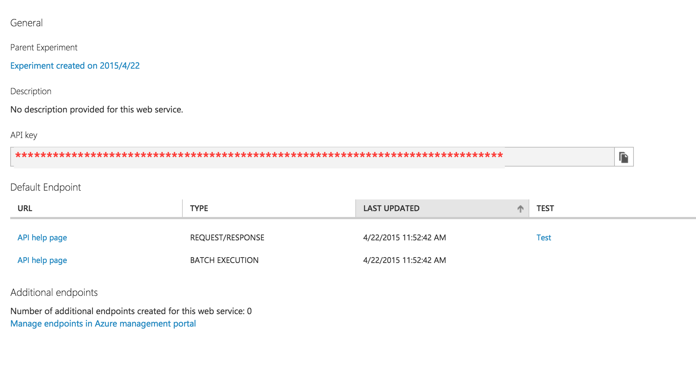
- エンドポイント
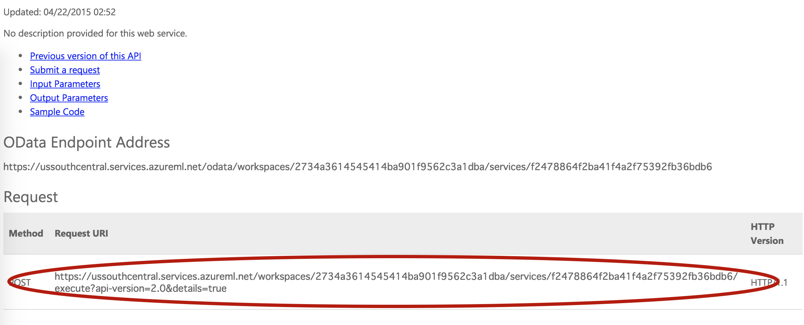

上記二つの情報を確認フォームの0.Azure MLのAPI情報に入力
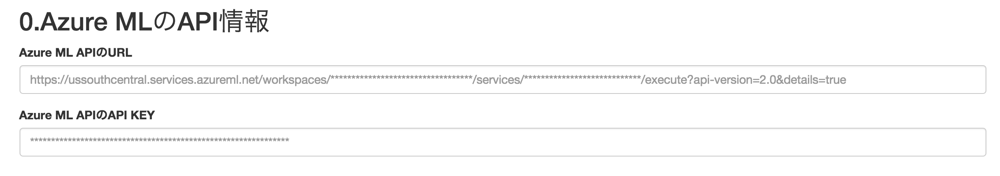

### 手書きの文字を認識する。

- ペイント等で文字を書きます。
- 書いた文字をアップロードします。

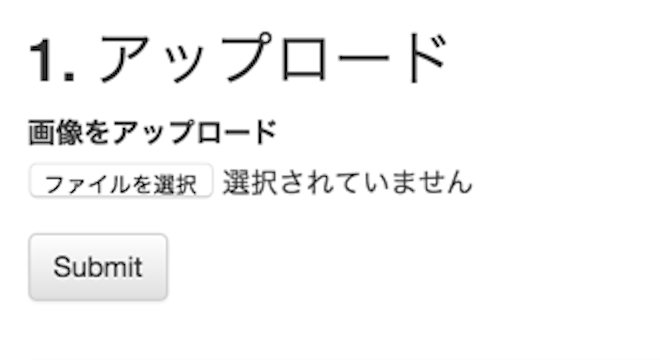

- アップロードされた画像はリサイズされます。
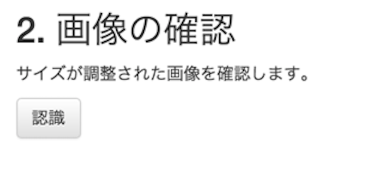

- 文字認識完了
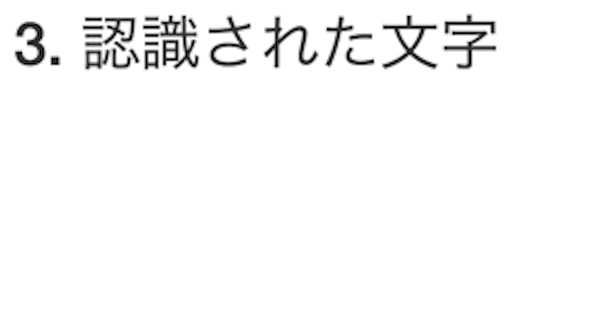


---

## MNIST 確認フォームのインストール
### インストール

#### VM

新しく仮想マシンを立ち上げ、SSHでログイン

```sh
$ sudo yum -y install httpd php php-mbstring php-gd git
$ git clone https://github.com/tottok-ug/azure-ml-mnist-test-web-ui.git
```


PHPの動くWebサーバのドキュメントルートに

public/配下の

+ img/
+ js/
+ css/
+ detect.php
+ index.html
+ upload.php

を入れておく。

#### docker

##### Requirements
[docker](https://docs.docker.com/engine/installation/)

##### To Use
```sh
./docker_run.sh
open http://localhost
```
